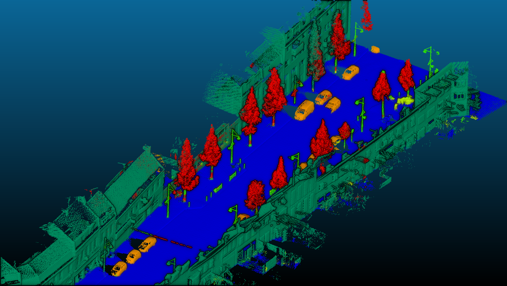
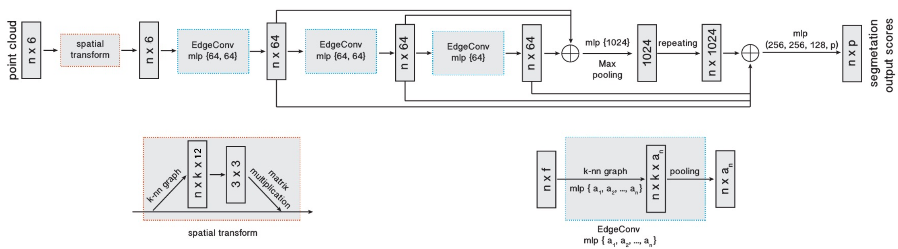

# Dynamic Graph CNN for Semantic segmentation
This repository contains our work for the Nuage de points et Modélisation 3D given by François Goulette, Jean-Emmanuel Deschaud and Tamy Boubekeur. We based our work around the code provided [here](https://github.com/WangYueFt/dgcnn) by the authors of [Dynamic Graph CNN for Learning on Point Clouds](https://arxiv.org/abs/1801.07829). We implemented a network for semantic segmentation of 3D point clouds and a training procedure to work on the [Benchmark on 3D Point Cloud classification for Master NPM3D Course](https://npm3d.fr/benchmark-for-master-course-on-3d-point-clouds).



Our model have the following topology.



## Data preprocessing
The dataset should be located in the ```data``` folder. We used CloudCompare to compute the normals of the point clouds, the resulting file sould end in ```al.ply```. The file tree should look like this
```
.|
 | data
   | MiniChallenge
     | test
       | MiniDijon9_al.ply
     | train
       | MiniLille1_al.ply
       | MiniLille2_al.ply
       | MiniParis1_al.ply
```

## For training
```
python3 main_seg.py --exp_name=seg --workers 6 --num_points=1024 --k=20  --tnet 1 --loss bce --epochs 10000
```


## To apply a model
Classify ```repeat``` * ```num_points``` points.
```
python3 test_seg.py --exp_name=seg --model=checkpoints/seg/models/model.t7 --workers 6 --num_points=1024 --k=20  --tnet 1 --repeat 50
```

kNN interpolation to get the labels of the remaining points.
```
python3 interpolate_results.py
```

Compute IoU.
```
python3 computeiou.py
```

Note that more options are available for all of this programs. They can be displayed using the option ```-h```.
